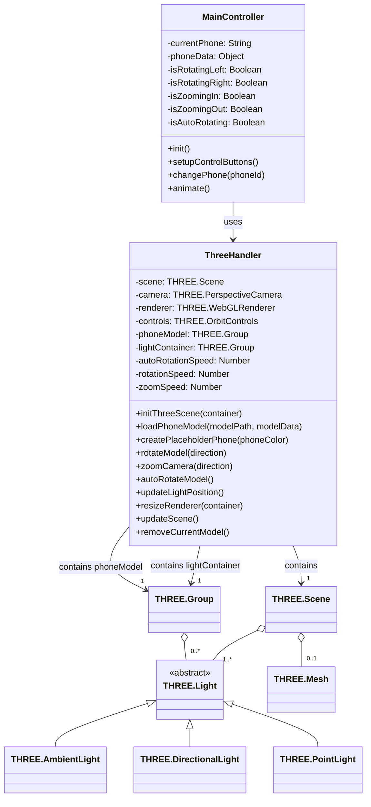

```mermaid
classDiagram
    class ThreeHandler {
        -scene: THREE.Scene
        -camera: THREE.PerspectiveCamera
        -renderer: THREE.WebGLRenderer
        -controls: THREE.OrbitControls
        -phoneModel: THREE.Group
        -lightContainer: THREE.Group
        -autoRotationSpeed: Number
        -rotationSpeed: Number
        -zoomSpeed: Number
        +initThreeScene(container)
        +loadPhoneModel(modelPath, modelData)
        +createPlaceholderPhone(phoneColor)
        +rotateModel(direction)
        +zoomCamera(direction)
        +autoRotateModel()
        +updateLightPosition()
        +resizeRenderer(container)
        +updateScene()
        +removeCurrentModel()
    }

    class MainController {
        -currentPhone: String
        -phoneData: Object
        -isRotatingLeft: Boolean
        -isRotatingRight: Boolean
        -isZoomingIn: Boolean
        -isZoomingOut: Boolean
        -isAutoRotating: Boolean
        +init()
        +setupControlButtons()
        +changePhone(phoneId)
        +animate()
    }

    class THREE.Scene
    class THREE.Group
    class THREE.Light {
        <<abstract>>
    }
    class THREE.AmbientLight
    class THREE.DirectionalLight
    class THREE.PointLight
    class THREE.Mesh

    MainController --> ThreeHandler : uses
    ThreeHandler --> "1" THREE.Scene : contains
    ThreeHandler --> "1" THREE.Group : contains phoneModel
    ThreeHandler --> "1" THREE.Group : contains lightContainer
    THREE.Light <|-- THREE.AmbientLight
    THREE.Light <|-- THREE.DirectionalLight
    THREE.Light <|-- THREE.PointLight
    THREE.Group o-- "0..*" THREE.Light
    THREE.Scene o-- "1..*" THREE.Light
    THREE.Scene o-- "0..1" THREE.Mesh

click ThreeHandler call linkCallback("d:/Projects/GitHub/ChrisTorng/3d-phone-show/js/three-handler.js")
click MainController call linkCallback("d:/Projects/GitHub/ChrisTorng/3d-phone-show/js/main.js")
```